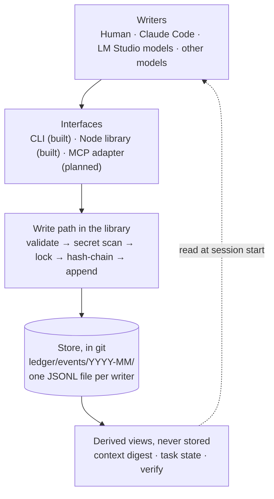
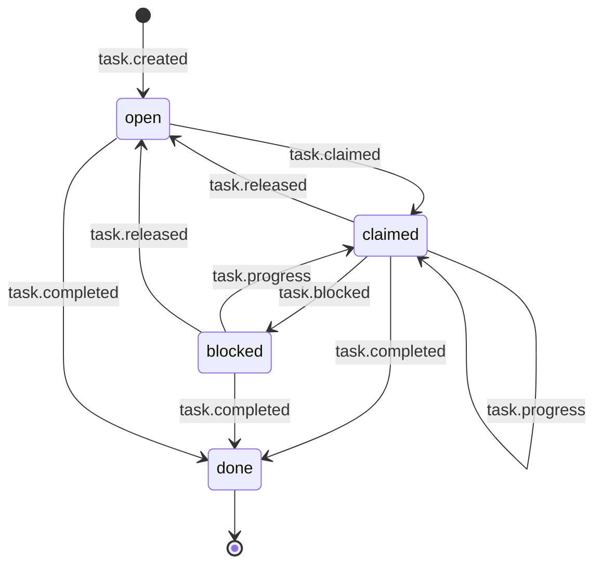
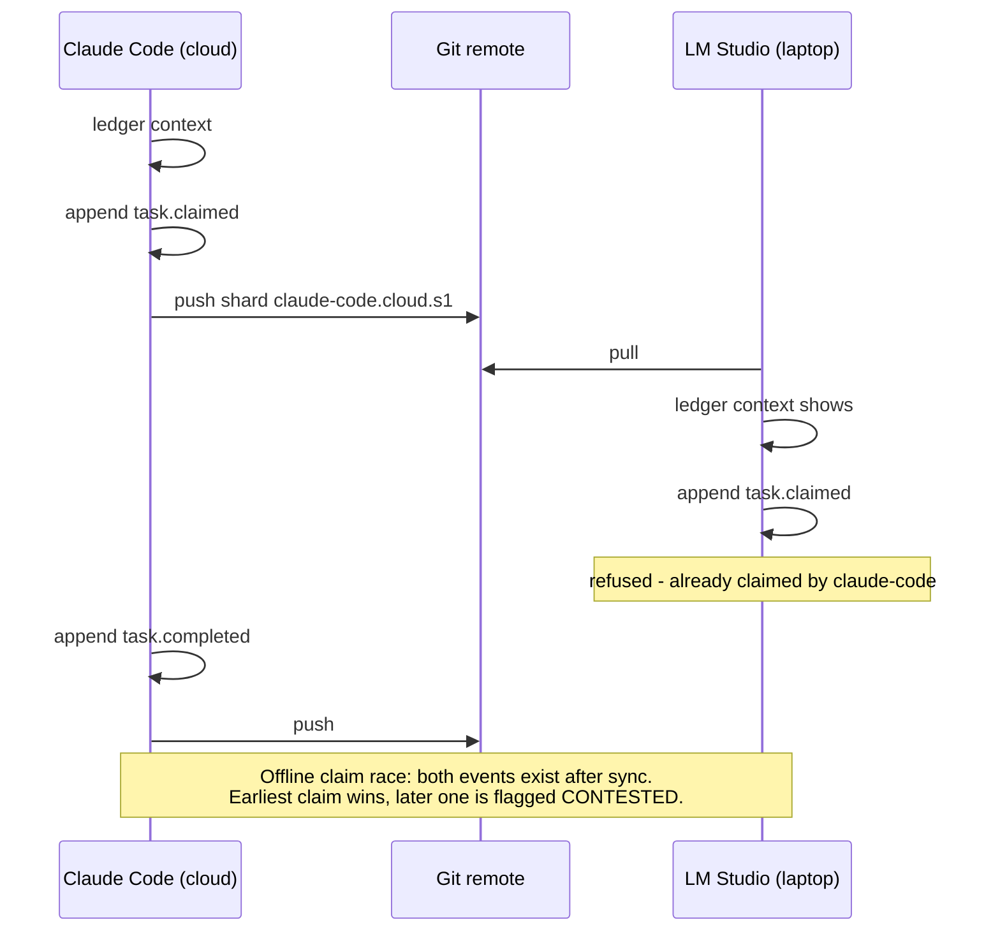

# Shared activity ledger - design (v0.1)

Status: **core built** (library, CLI, tests, schema). Adapters (MCP, hooks, proxy) are designed, not built.
Decision record: [ADR 0004](../adr/0004-shared-activity-ledger-jsonl-sharded-by-writer.md).
Code: `tools/ledger/` · Data: `ledger/` · Schema: `ledger/schema/event.v1.schema.json`.

## 1. Problem

Work on Map It Out is done by several actors on several devices: the owner (phone, laptop, terminal),
Claude (cloud and CLI), local models in LM Studio, and possibly other frontier models. Each has its own
memory, so what one did is invisible to the others, decisions get lost and work is repeated.
The owner's requirement: *everyone must know what everyone else is doing, and it must all link together.*

## 2. Goals and non-goals

| Goals | Non-goals (for now) |
|---|---|
| One record of who did what, when, why, with links to the artifacts | A chat transcript store or full memory (that is the separate memory repo, see 9) |
| Works headless: no UI, no server, no database | A multi-tenant product API (later, wraps the same events) |
| Any LLM or tool can write to it and read from it | Storing customer data, quotes or personal information |
| Safe across devices via git: no write conflicts | Real-time sync; git push/pull cadence is enough |
| Cheap to read first: a budgeted digest fits a small model's context | Search/analytics over the log |
| Tamper-evident and secret-free by construction | Protection from a malicious writer with repo write access (see 7) |

## 3. Architecture

Principles:
1. **Append-only facts, derived views.** Events are never edited. Task ownership, status and the
   context digest are computed by replaying events, so there is nothing to keep in sync.
2. **One file per writer.** The shard name is `actor.host.session.<hash>.jsonl` under `events/YYYY-MM/`; the 8-hex hash is over the raw identity, so two identities whose readable slugs collide ("Claude Code" vs "claude-code") still get separate files. Two devices never
   append to the same file, so `git pull` never conflicts. (Same actor + host + session = same file, guarded by a lock that records its owner process; a lock whose owner died on this host, or that outlived a 10-minute lease, is taken over, a live owner never is.) The lock only coordinates processes on one checkout, so **identities must differ per device**: two checkouts using the same actor, host and session would append to the same file and conflict at sync. If `LEDGER_HOST` is set to a role alias, give each device its own alias.
3. **Validate on the way in, not on the way out.** A bad or secret-bearing event never reaches disk.
4. **Small events, links not blobs.** An event is a sentence plus refs (file, commit, pr, issue, adr, diagram, url, asset, event).
   Large content stays in the repo or the diagram; the ledger points at it.

## 4. Event model (schema v1)

| Field | Required | Notes |
|---|---|---|
| `v` | yes | Schema version, currently 1 |
| `id` | yes | `<12 hex epoch-ms>-<4 hex counter><6 hex random>`; strictly increasing within a process |
| `ts` | yes | UTC in exactly the `Date#toISOString` format; must be a real calendar date (the JSON Schema pattern enforces this, leap years included) |
| `project` | yes | Default `mapitout`; lets one ledger serve several projects |
| `type` | yes | See below |
| `summary` | yes | 1-500 chars, one sentence: what and why |
| `actor` | yes | `{kind: human\|agent\|model\|system, name, model?, host?, session?}` |
| `task` | no | Task id the event belongs to |
| `parent` | no | Event id this responds to (hand-offs, replies) |
| `refs` | no | Up to 20 `{kind, ref, note?}` |
| `data` | no | Small type-specific object, at most 4 KB |
| `prev` / `hash` | yes | Per-shard hash chain (SHA-256 over canonical JSON) |

Event types: `session.started/ended`, `note`, `decision`, `error`, `handoff`,
`task.created/claimed/progress/blocked/released/completed`, `artifact.created/changed`, `diagram.changed`,
`tool.call`, `asset.registered`.

Conventions:
- `decision` events should reference the ADR (`--ref adr:0004`). Decisions live in ADRs; the ledger records that and when they were made.
- `handoff` is written when stopping, to say what the next actor should know. It is always shown in the digest.
- `asset.registered` exists so an asset register can be rebuilt from the log (see 9).

### Task lifecycle (derived, not stored)

A completed task is terminal: later claim/progress/block/release events are refused on write and ignored when replayed. All `task.*` appends also take a ledger-wide lock so the owner check and the claim are atomic on one checkout.

Ownership rules: only the owner can release a task (or a human actor, to free an abandoned claim). When the owner releases,
the next claimant, if there is one, inherits it. A losing claimant who releases only withdraws its own claim; a release by
anyone else changes nothing.

### Two devices, one task

## 5. Interfaces

| Surface | Status | Purpose |
|---|---|---|
| Library `tools/ledger/ledger.mjs` | built | `append`, `readAll`, `verify`, `deriveTasks`, `buildContext`, `validate`, `schema` |
| CLI `tools/ledger/cli.mjs` | built | `append`, `tail`, `context`, `tasks`, `verify`, `schema`; identity from `LEDGER_*` env vars |
| JSON Schema | built | Generated from the code constants; a test fails if the committed file drifts |
| CI | built | Runs tests and `ledger verify` on every change under `tools/ledger/` or `ledger/` |
| MCP adapter | designed | Tools `ledger_append`, `ledger_context`, `ledger_tasks` so any MCP-capable client can use the ledger |
| Claude Code hooks | designed | SessionStart runs `context`; Stop appends a `handoff` (fixes "memory skewed across devices") |
| LM Studio route | OPEN | See 6 |
| HTTP API (product) | later | Wraps the same library and schema |

### The context digest

`ledger context --since 14d --max-chars 6000` prints Markdown: open tasks (with owner and CONTESTED flags),
latest hand-offs, last 10 decisions, then recent activity newest-last. The header, tasks, hand-offs and decisions
are kept first and are bounded (25 task lines, 3 hand-offs, 10 decisions, summaries cut at 200 characters); the **oldest activity lines are
dropped first** and the cut is stated. `--max-chars` is a hard limit: if it is smaller than the fixed sections, the tail is cut and marked,
so a small local model's context window is respected. This is the "read this first" for every actor.

## 6. How LM Studio gets in (OPEN)

LM Studio cannot write to the ledger by itself. A local model's work becomes visible only if something
writes it. Options, none built yet:

| Option | How | Trade-off |
|---|---|---|
| A. MCP adapter | LM Studio calls the ledger tools as an MCP client (needs verifying that the installed LM Studio version supports MCP) | Best: the model records and reads itself |
| B. Logging proxy | A small proxy in front of `localhost:1234` appends a `tool.call` event per request (summary only, never the prompt body) | Automatic, but records activity not intent |
| C. Wrapper script | The person or an agent appends a summary after a session | Works today; relies on discipline |

Recommendation: build A (it is the same adapter every other client needs), use C until then.

## 7. Quality attributes

Measured on this sandbox with Node 22 (no tuning); re-run after changes that touch storage.

| Attribute | How it is met | Evidence |
|---|---|---|
| Reliability | Append-only; per-shard exclusive lock; verify checks hash, chain, schema, secrets, duplicate ids | Concurrency test: 8 parallel processes on one shard keep the chain intact; the same test fails with the lock removed |
| Ordering | Monotonic ids within a process; shards are merged by `(ts, id)` but each shard keeps its own file (chain) order, so a backwards clock step can not reorder a writer's events | Regression test for same-millisecond events (a random tiebreak had scrambled them) |
| Security | Secret scanner rejects keys/tokens/private keys on write and in verify; no personal or customer data by policy; shards written only through the library | Tests for 5 secret formats plus a data-field case |
| Integrity | Tampering or deleting an event breaks the hash or chain and `verify` fails | Tamper and delete tests |
| Maintainability | Zero dependencies; one validator is authoritative and the JSON Schema is generated from the same constants | Schema-sync test |
| Performance | Append reads only the file tail (the window grows if the last event is larger); reads scan all shards | 20,000 events: append 0.8 ms each, readAll 68 ms, verify 319 ms, context 24 ms |

Scale limit: reads are a full scan, fine into the low hundreds of thousands of events. Past roughly 100k events,
add monthly snapshots or archive old months. Not needed now.

Honest limits:
- The hash chain is **tamper-evident, not tamper-proof**. Someone with write access can rewrite a whole shard
  consistently. Git history is the real anchor; signed commits are the next step if provenance matters (OPEN).
- The secret scanner is pattern-based. It will miss unusual formats. It is a safety net, not a licence to paste credentials.
- A git repo is not a vault: the ledger holds work metadata only. No customer names, addresses, prices or quotes.
- Timestamps come from each device's clock. Per-writer order is exact (chain); cross-device order is best-effort.
- Simultaneous claims on two offline devices cannot be refused; they are detected after sync and flagged CONTESTED.

## 8. Phasing

| Phase | Scope | State |
|---|---|---|
| 1 | Schema, library, CLI, tests, CI, ADRs, seed events | **built** |
| 2 | MCP adapter; Claude Code SessionStart/Stop hooks; `ledger_context` in LM Studio | designed |
| 3 | Logging proxy; asset register view; signed commits | designed / OPEN |
| 4 | HTTP API for the product; Quick Quote audit events (metadata only); retention policy | later |

## 9. Related, planned work

- **Memory repo (separate, planned by the owner; design: [memory/DESIGN.md](../memory/DESIGN.md), [ADR 0007](../adr/0007-session-memory-in-a-separate-private-repo.md)).** A repo for long-running context across devices and chats.
  The ledger is deliberately portable (plain files, no server) so it can move into or sit beside that repo.
  Whether they merge is OPEN. The earlier lost *asset register* is the motivating example: `asset.registered`
  events are the proposed way to make it rebuildable.
- **Map It Quick Quote (future note).** If Quick Quote becomes a product, its audit trail (quote created,
  reviewed, sent) can reuse this event model with a stricter, PII-free policy and a server-side store.
  Recorded here so the choice stays open; nothing is built.

## 10. Open decisions

1. LM Studio route: A, B or C (section 6).
2. Whether the ledger lives in this repo, the memory repo, or both.
3. Signed commits / signatures for provenance.
4. Retention and archival policy.
5. A PII scanner if the ledger is ever used for Quick Quote.
